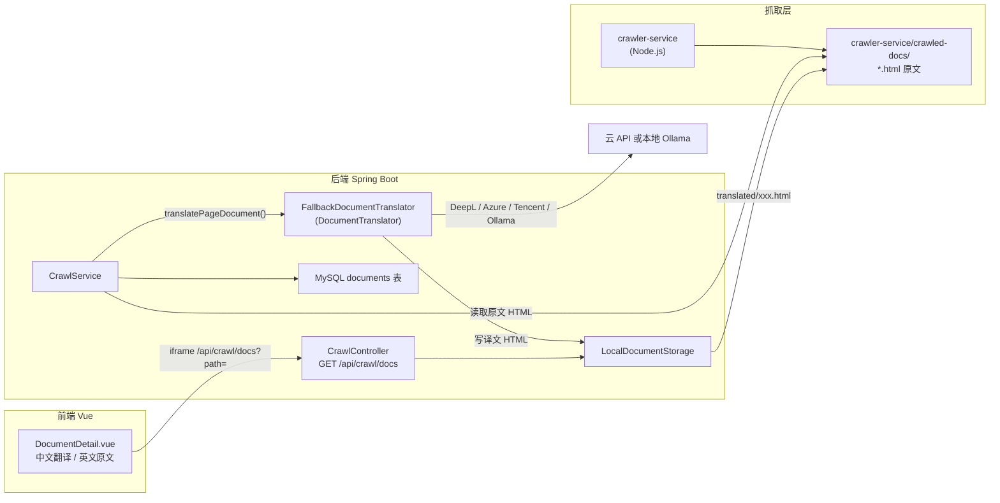

# 文档翻译功能现状

## 结论（一句话）

**文档翻译的核心实现位于后端 `DocumentTranslator`（多引擎）+ `CrawlService`；默认 DeepL，可切换 Azure / 腾讯 TMT / Ollama，并支持配额失败时自动降级；`crawler-service` 只负责抓取 HTML；前端 `DocumentDetail.vue` 只展示原文/译文。**

---

## 架构与数据流



---

## 1. 翻译引擎（多引擎）

| 组件 | 路径 | 职责 |
|------|------|------|
| **DocumentTranslator** | `translator/DocumentTranslator.java` | 统一接口：`translateHtmlToChinese`、`isConfigured` |
| **AbstractHtmlDocumentTranslator** | `translator/AbstractHtmlDocumentTranslator.java` | 共享 Jsoup 分块、placeholder、结构保留逻辑 |
| **FallbackDocumentTranslator** | `translator/FallbackDocumentTranslator.java` | `@Primary` 实现；按 `translation.provider` 选主引擎，`fallback-providers` 在配额/限流时降级 |
| **DeepLTranslator** | `translator/DeepLTranslator.java` | DeepL `/v2/translate` |
| **AzureTranslator** | `translator/AzureTranslator.java` | Azure Cognitive Translator v3 |
| **TencentTranslator** | `translator/TencentTranslator.java` | 腾讯云 TMT TextTranslate |
| **OllamaTranslator** | `translator/OllamaTranslator.java` | 本地 Ollama `/api/generate` |
| **配置** | `application.yml` | `translation.provider`、`fallback-providers` 及各引擎密钥 |

```yaml
translation:
  provider: deepl          # deepl | azure | tencent | ollama
  fallback-providers:      # 主引擎 retryable 失败（如 DeepL 456 配额）时依次尝试
    - azure
    - ollama
  deepl:
    api-key: ${DEEPL_API_KEY:}
  azure:
    subscription-key: ${AZURE_TRANSLATOR_KEY:}
    region: global
  tencent:
    secret-id: ${TENCENT_SECRET_ID:}
    secret-key: ${TENCENT_SECRET_KEY:}
  ollama:
    base-url: http://localhost:11434
    model: qwen2.5:7b
```

**未配置任何引擎凭证时**：跳过翻译，前端会提示「翻译内容尚未生成」。

**DeepL Free vs Pro 端点**：Free 密钥以 `:fx` 结尾 → `api-free.deepl.com`；Pro → `api.deepl.com`（启动时自动纠正）。

---

## 2. 翻译触发时机：CrawlService

| 组件 | 路径 | 职责 |
|------|------|------|
| **CrawlService** | `backend/src/main/java/com/translationapp/service/CrawlService.java` | 爬取任务完成后导入页面并可选翻译 |

主要流程（文档型任务）：

1. `processDocumentTask()` → `importCrawledPages(..., shouldTranslate)`
2. `shouldTranslateOnCrawl()`：`translation.on-crawl=true` 且至少一个翻译引擎已配置
3. 每页保存后调用 `translatePageDocument(doc)`：
   - 从 `localPath` 读原文 HTML
   - 优先翻译 `main.article`，否则翻译 `body`
   - 译文写入 `translated/{localPath}`（见 `LocalDocumentStorage.translatedRelativePath`）
   - 更新 `Document.translatedLocalPath`

另有旧逻辑 `processSections()`：把章节内容译后存入 DB 字段 `translatedContent`（用于分段文档，非 iframe 模式）。

---

## 3. 文件存储：LocalDocumentStorage

| 组件 | 路径 | 职责 |
|------|------|------|
| **LocalDocumentStorage** | `backend/src/main/java/com/translationapp/service/LocalDocumentStorage.java` | 读写 `crawler-service/crawled-docs/` |

- 原文：`overview.html`、`core/beans.html` 等
- 译文：`translated/overview.html`、`translated/core/beans.html` 等（前缀 `translated/`）

---

## 4. 数据模型

`Document` 实体（`backend/src/main/java/com/translationapp/entity/Document.java`）字段：

- `localPath` — 原文相对路径
- `translatedLocalPath` — 译文 HTML 路径（iframe 展示用）
- `originalContent` / `translatedContent` — 数据库内 HTML 片段（分段模式）

---

## 5. 前端展示（不执行翻译）

`frontend/src/views/DocumentDetail.vue`：

- Tab **「中文翻译」**：有 `translatedLocalPath` 时 iframe 加载 `/api/crawl/docs?path=...&theme=...`
- Tab **「英文原文」**：iframe 加载 `localPath` 对应原文
- 无译文时显示提示，并 fallback 展示原文

`CrawlController` 的 `GET /api/crawl/docs` 从磁盘读 HTML 并注入预览样式。

---

## 6. crawler-service 的角色

`crawler-service/` **不包含翻译逻辑**，仅：

- 抓取站点 HTML 到 `crawled-docs/`
- 维护目录（TOC）脚本会读取 `translated_local_path` 字段，但不生成译文

翻译发生在 **Java 后端导入/处理爬取结果时**。

---

## 7. 当前限制

- **多引擎 EN→ZH**：DeepL / Azure / 腾讯 TMT / Ollama，通过 `translation.provider` 切换
- **自动降级**：主引擎配额或限流失败时尝试 `fallback-providers`
- **批量/on-crawl**：无独立「单页即时翻译」REST 接口（只有内部 `translatePageDocument`）
- **依赖 API Key**：未配置则只有原文
- **无视频/附件翻译**：`VideoService` 等与翻译无关

---

## 若要启用翻译

1. 配置主引擎（例如 `DEEPL_API_KEY` 或 `AZURE_TRANSLATOR_KEY`）
2. 可选设置 `translation.fallback-providers`（DeepL 配额用尽时降级）
3. 确保 `translation.on-crawl=true`（默认已开）
4. 重新爬取或调用 `POST /api/crawl/tasks/{id}/retranslate`

已有爬取数据可检查 `documents.translated_local_path` 及 `crawler-service/crawled-docs/translated/` 目录是否有文件。

更多环境变量说明见项目根目录 [SETUP.md](../SETUP.md)。
